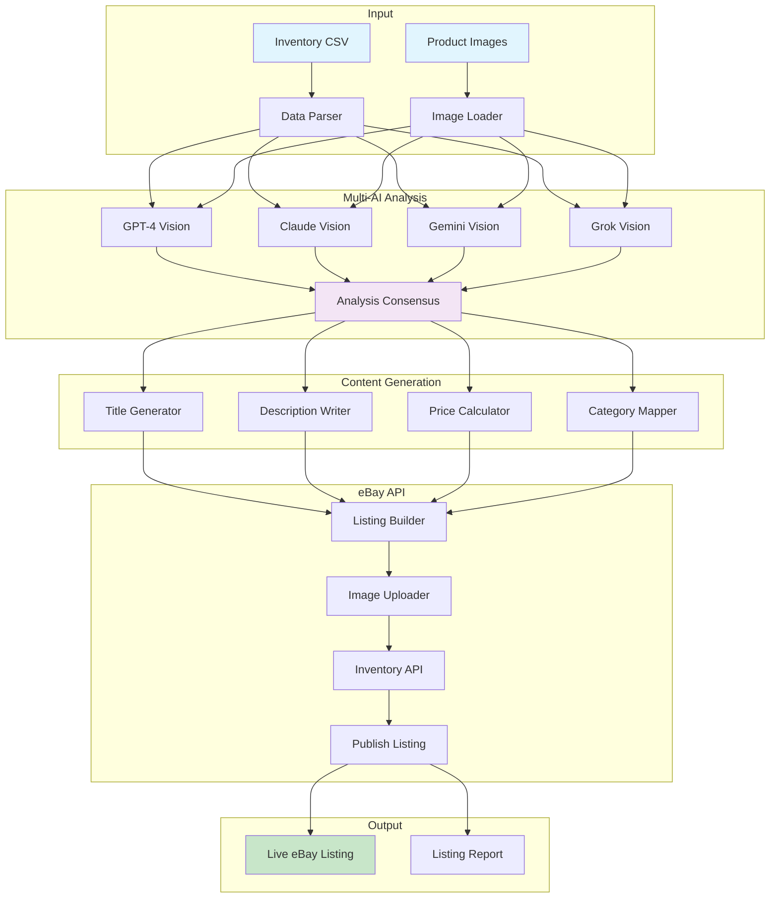

# eBay Listing Automation


[](https://codecov.io/gh/jjshay/ebay-listing-automation)


**Automatically create professional eBay listings from inventory data - AI-powered descriptions, pricing, and images.**

[](https://asciinema.org/a/lsIT0feupDDs41at)

[](https://asciinema.org/a/lsIT0feupDDs41at)

---

## What Does This Do?

Turn your inventory spreadsheet into live eBay listings:

1. **Analyzes product images** using AI vision
2. **Generates descriptions** - professional, keyword-rich
3. **Suggests pricing** based on market data
4. **Creates listings** via eBay API
5. **Manages inventory** across platforms

---

## Quick Start

```bash
# Clone the repo
git clone https://github.com/jjshay/ebay-listing-automation.git
cd ebay-listing-automation

# Install dependencies
pip install -r requirements.txt

# Run the interactive demo (no API keys needed!)
python demo.py

# Or run the visual showcase
python showcase.py

# Try with sample data
python demo.py --inventory examples/sample_inventory.csv
```

### Sample Files
- `examples/sample_inventory.csv` - Sample product inventory
- `examples/sample_product.json` - Single product config
- `examples/artwork_main.jpg` - Sample product image
- `sample_output/generated_listing.json` - Example output

---

## Architecture



## How It Works

```
Inventory Data (CSV/Google Sheet)
              │
              ▼
┌─────────────────────────────────────────┐
│         AI IMAGE ANALYSIS               │
│  GPT-4V + Claude + Gemini + Grok       │
│  - Identify artwork/product            │
│  - Extract details (artist, medium)    │
│  - Assess condition                    │
└─────────────────────────────────────────┘
              │
              ▼
┌─────────────────────────────────────────┐
│       DESCRIPTION GENERATION            │
│  - Professional gallery-style text     │
│  - SEO keywords included               │
│  - Specs and measurements              │
└─────────────────────────────────────────┘
              │
              ▼
┌─────────────────────────────────────────┐
│         eBay API INTEGRATION            │
│  - Create inventory item               │
│  - Upload images                       │
│  - Set pricing and policies            │
│  - Publish listing                     │
└─────────────────────────────────────────┘
              │
              ▼
        Live eBay Listing!
```

---

## Features

| Feature | Description |
|---------|-------------|
| Multi-AI Analysis | 4 AI models analyze each product image |
| Smart Descriptions | Gallery-quality, keyword-optimized text |
| Dynamic Pricing | Based on condition, rarity, market data |
| Category Mapping | Auto-selects correct eBay category |
| Image Optimization | Resize, crop, enhance for eBay |
| Bulk Processing | Handle hundreds of listings |
| Inventory Sync | Keep stock levels accurate |

---

## Listing Templates

### Contemporary Art
```
Title: {artist} - {title} {medium} {year}
Keywords: contemporary art, modern art, gallery, original
```

### Vintage Art
```
Title: Vintage {artist} - {title} {year}
Keywords: vintage art, collectible, estate, authentic
```

### Limited Edition Print
```
Title: {artist} {title} Print {edition}
Keywords: art print, limited edition, numbered, signed
```

---

## Generated Description Example

```
SHEPARD FAIREY - "Hope" Signed Screen Print (2008)

This iconic work by street art legend Shepard Fairey captures the
spirit of a generation. Hand-signed by the artist in pencil.

DETAILS:
• Medium: Screen print on heavy archival paper
• Size: 24" x 36" (61 x 91 cm)
• Edition: 450/500
• Condition: Excellent, never framed
• Signature: Hand-signed lower right

PROVENANCE:
Acquired directly from Obey Giant gallery, 2008.
Certificate of authenticity included.

SHIPPING:
Ships flat in custom art packaging with full insurance.
International shipping available.
```

---

## Setup

### 1. eBay Developer Account
1. Go to [developer.ebay.com](https://developer.ebay.com)
2. Create application
3. Get API credentials

### 2. Configure Environment
```bash
cp .env.example .env
nano .env
```

Add your credentials:
```
EBAY_APP_ID=your_app_id
EBAY_CERT_ID=your_cert_id
EBAY_DEV_ID=your_dev_id
EBAY_TOKEN=your_oauth_token
```

### 3. Run
```bash
python ebay_listing_automation.py
```

---

## Files

| File | Purpose |
|------|---------|
| `ebay_listing_automation.py` | Main listing creator |
| `ebay_api_integration.py` | eBay API wrapper |
| `enhanced_inventory_creator.py` | Multi-AI product analysis |
| `ebay_art_analyzer.py` | Art-specific analysis |
| `demo.py` | Demo without API keys |

---

## Supported Categories

- Art (Paintings, Prints, Photographs)
- Collectibles
- Antiques
- Home Decor
- Custom categories

---

## License

MIT - Automate your eBay business!
